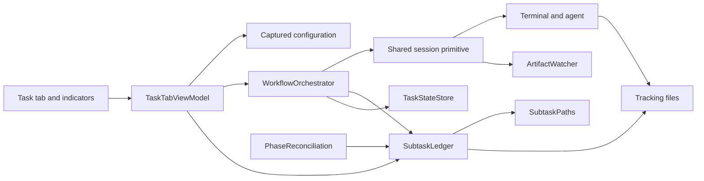
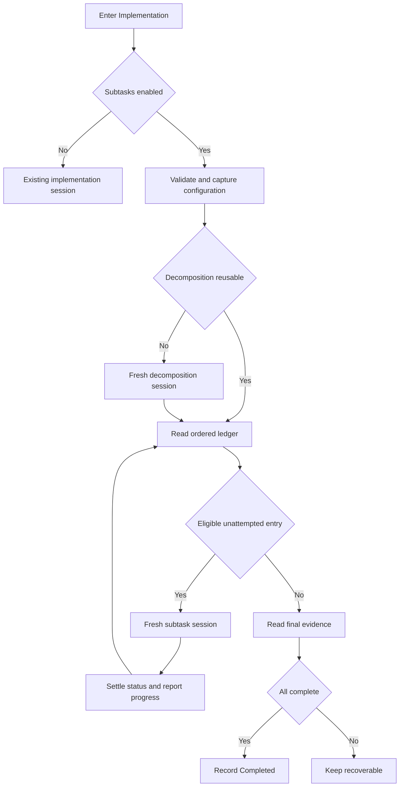

# Design Document

## Overview

**Status: imported design draft, validated and fully resolved 2026-09-18.** The user explicitly requested requirements and design together for review. This is an import of existing decisions, not an approval bypass for implementation. `spec.json` records both generated documents with approvals false.

The validation review resolved **all twelve** recorded source conflicts. Issues 1, 2, 3, 5, 6, 9 and 10 were settled in the first pass; issues 4, 7, 8, 11 and 12 in the second. Every decision is written into the sections below and summarized under **Resolved Decisions**. No open issue blocks task generation.

Workflow gains optional sequential subtask execution during phase 4. A decomposition session creates an ordered index in a separate tracking repository; each eligible subtask then runs in a fresh terminal session. The disk ledger supplies progress and recovery evidence.

Sources: [SPEC](../../../docs/superpowers/specs/2026-09-17-subtask-execution-design.md) and [PLAN](../../../docs/superpowers/plans/2026-09-17-subtask-execution-plan.md). SPEC section and PLAN task references are provenance, not newly generated tasks. Technical decisions below come from those artifacts; every source conflict has been resolved in the 2026-09-18 validation and is recorded in **Resolved Decisions**. Original codebase assertions in SPEC section 3 are historical source assertions, not a fresh verification of every integration point.

### Goals

Implement requirements 1–7 while preserving the existing normal phase-4 path, existing terminal/session mechanics, ordered execution, one attempt per subtask per run, and disk-derived recovery.

### Non-Goals

No parallel/nested execution, automatic in-run retry, execution timeout, subtask editor, old-task migration, application git automation, or interpretation of unrelated tracking documents. Same-name tracking collisions remain the documented limitation in SPEC E14.

## Boundary Commitments

### This Spec Owns

- Subtask configuration, phase-4 branching, sequential session orchestration, progress presentation, and recovery integration.
- The path/token/index/status/flag contract between the Workflow application and agent sessions.
- Required corrections to the two Workflow prompts, the missing external status template, and non-empty external `result.json` examples. Deleting `verification.json` and adding a tracking-repo README are explicitly out of scope (issue 8 resolved).
- Removal of `Phase abschliessen`, preservation of `ManualPhaseSignal` for task completion, and awaiting the run before closing its tab.

### Out of Boundary

- Product implementation performed by each agent session and agent-managed tracking documents such as `task_plan.md`, `findings.md`, `progress.md`, and `verification.json`.
- Tracking repository git lifecycle and synchronization, task-name collision coordination, or a new completion rule for unrelated files.
- Unrelated changes already present in the working tree. This import modifies no application, prompt, original artifact, or external repository files.

### Allowed Dependencies

- Existing `TaskPaths`, `WorkingDirectoryPath`, `PhaseCatalog`, `ArtifactWatcher`/factory, terminal controller, prompt renderer, journal store, settings service, directory picker, and recovery infrastructure.
- Existing WPF/MVVM views, progress dispatch via `IProgress<T>`, converters, and theme resources.
- User-managed Workflows directory, recognized by `task_template`; agents write its process files. The application reads only index/flag `result.json`, `status.json`, and `subtask.md`, creates necessary directories, and deletes only stale result flags.
- Models supply contracts to services; view models consume services/models; views bind view models. Ledger and path models do not depend on UI or orchestration. Progress contracts do not introduce a reverse UI dependency.

### Revalidation Triggers

Changes to token sets, path composition, index/status rules, manual completion semantics, configuration capture, journal fields/version, recovery evidence, prompt startup validation, or external template publication require rechecking all affected producers and consumers before tasks are approved.

## Architecture

### Existing Architecture Analysis

The sources describe a fixed four-phase workflow with one live terminal per tab and file-watcher completion. Reuse `ArtifactWatcher` including its polling fallback and non-empty-file rule. Extract one session primitive instead of duplicating terminal settle/render/paste/submit behavior. Keep `PhaseStatus` as `Pending`, `Active`, and `Completed` and `TaskState.CurrentVersion` at 1.

The current project file confirms `net8.0-windows`, existing UI package versions below, and prompt markdown copying through `Prompt\**\*.md`. No new dependency or project-file change is proposed. No `.kiro/steering` documents are present; this import does not invent project policy.

### Architecture Pattern & Boundary Map

### Technology Stack

| Layer | Existing choice | Role |
|---|---|---|
| Runtime | .NET 8, `net8.0-windows` | Existing application runtime |
| UI | WPF, CommunityToolkit.Mvvm 8.4.2 | Observable properties and commands |
| Presentation | MaterialDesignThemes 5.3.2, MahApps.Metro 2.4.11 | Existing controls and colours |
| Storage | Files and `System.Text.Json` | Settings, journal, index and status |
| Tests | xunit 2.9.2, Xunit.StaFact 1.1.11 (PLAN) | Filesystem/session and dispatcher-aware checks |

These are imported stack choices, not dependency upgrades or newly researched API recommendations.

## File Structure Plan

Paths below are relative to the Workflow repository except rows explicitly marked external. They describe the source plan's intended ownership, not files changed by this import.

| Action | File | Responsibility |
|---|---|---|
| Create | `Workflow/Models/SubtaskPaths.cs` | Tracking path composition and safe title validation |
| Create | `Workflow/Models/SubtaskStatus.cs` | Status, state, snapshot, stage and progress data contracts |
| Create | `Workflow/Models/SubtaskLedger.cs` | Sole interpretation of tracking evidence |
| Create | `Workflow/Models/WorkflowDirectoryValidation.cs` | Tracking-directory validation and German errors |
| Create | `Workflow/Models/PromptTemplateCatalog.cs` | All shipped templates (currently eight) and per-file token sets |
| Create | `Workflow/Services/ISubtaskConfiguration.cs` | Configuration capture source and the immutable `SubtaskConfiguration` record |
| Create | `Workflow/Services/SubtaskConfigurationException.cs` | User-fixable directory/index errors |
| Create | `Workflow/ViewModels/SubtaskIndicatorViewModel.cs` | Progress and failure presentation |
| Create | `Workflow/Views/SubtaskIndicatorView.xaml`, `Workflow/Views/SubtaskIndicatorView.xaml.cs` | Second indicator |
| Modify | `Workflow/Models/AppSettings.cs` | Workflow-directory last choice and MRU fields |
| Modify | `Workflow/Services/ISettingsService.cs`, `Workflow/Services/SettingsService.cs` | Separate MRU with shared promotion helper |
| Modify | `Workflow/Models/TaskState.cs` | Additive subtask settings, version unchanged |
| Modify | `Workflow/Services/ITaskStateStore.cs`, `Workflow/Services/TaskStateStore.cs` | Save subtask settings without changing dismissal |
| Modify | `Workflow/Models/PhaseReconciliation.cs` | Ledger evidence for subtask implementation completion |
| Modify | `Workflow/Services/PromptTemplateService.cs` | Layered variable builders and per-template startup validation |
| Documentation | `Workflow/Services/IPromptTemplateService.cs` | Updated validation contract comment, unchanged signature |
| Modify | `Workflow/Services/IWorkflowOrchestrator.cs` | Append optional configuration/progress request parameters |
| Modify | `Workflow/Services/WorkflowOrchestrator.cs` | Shared session primitive, decomposition, ordered loop |
| Modify | `Workflow/Services/IDirectoryPickerService.cs`, `Workflow/Services/DirectoryPickerService.cs` | Optional dialog title retaining existing default |
| Modify | `Workflow/ViewModels/TaskTabViewModel.cs` | Configuration, persistence, recovery, progress and task completion |
| Modify | `Workflow/Views/TaskTabView.xaml` | Checkbox, directory row and indicator |
| Modify | `Workflow/ViewModels/PhaseIndicatorViewModel.cs`, `Workflow/Views/PhaseIndicatorView.xaml` | Remove phase completion command presentation and `IsActive` |
| Modify, prompt contract | `Workflow/Prompt/create_subtasks.md`, `Workflow/Prompt/run_subtask.md` | Required protocol and substitution corrections |
| Modify | `Workflow/verify.ps1` | Extend existing acceptance checks |
| Create, external required | `C:/Users/Marco/Documents/repo/Workflows/task_template/subtasks/ST-001-subtask-template/status.json` | Missing per-subtask status example, with `"status": "pending"` (issue 8, mandatory) |
| Create/replace, external required | `C:/Users/Marco/Documents/repo/Workflows/task_template/result.json`, `C:/Users/Marco/Documents/repo/Workflows/task_template/subtasks/ST-001-subtask-template/result.json` | Non-empty example index and flag. The task-level file is absent and the subtask-level one is 0 bytes, which the non-empty-file rule reads as "no flag" — empty examples teach the wrong contract (issue 8, promoted to mandatory by the validation survey) |
| Out of scope | `C:/Users/Marco/Documents/repo/Workflows/task_template/subtasks/ST-001-subtask-template/verification.json`, `C:/Users/Marco/Documents/repo/Workflows/README.md` | Deletion and contract documentation are **not** part of this feature (issue 8 resolved). `verification.json` stays: `run_subtask.md` still references a verification gate and external consumers were not surveyed |

Test additions: `Workflow.Tests/SubtaskPathsTests.cs`, `SubtaskLedgerTests.cs`, `WorkflowDirectoryValidationTests.cs`, `PhaseReconciliationSubtaskTests.cs`, `PromptTemplateCatalogTests.cs`, `SubtaskConfigurationTests.cs`, `SubtaskOrchestratorTests.cs`, `SubtaskIndicatorViewModelTests.cs` (each under `Workflow.Tests/`). Existing test extensions cover settings, state store, prompt rendering, task tabs and resources; update `Workflow.Tests/Fakes/FakeTaskStateStore.cs` for the added interface member. Existing `Workflow.Tests/WorkflowOrchestratorTests.cs` assertions remain unchanged. Existing terminal fakes, recovery scanner, watcher and converters are dependencies, not new feature owners.

## Components and Interfaces

| Component | Contract | Requirements | Dependencies |
|---|---|---|---|
| SubtaskPaths / Ledger | Paths and disk-derived snapshots | 2.3, 2.4, 2.6, 2.10, 4.1–4.5, 6.1 | Tracking files, P0 |
| Configuration / persistence | Live configuration and additive settings | 1.1–1.7 | Settings/journal stores, P0 |
| Orchestrator | Sequential batch and shared session lifecycle | 2.1–2.10, 3.5, 3.6, 5.2, 5.3 | Terminal, watcher, renderer, ledger, P0 |
| Prompt catalog / variables | Per-file substitutions and validation | 6.2–6.4 | Corrected prompt files, P0 |
| Tab / indicator | Observable progress, controls and commands | 1.1–1.6, 3.1–3.7, 4.1, 5.1, 5.3 | Existing theme/converters, P1 |
| Reconciliation | Subtask completion evidence | 4.1–4.5 | Task state and ledger, P0 |
| External template | Status example | 6.5 | User-managed tracking repository, P0 for end-to-end validation |

### Paths and Ledger

`SubtaskPaths(string workflowDirectory, string taskName)` normalizes the directory and trims the task name. It supplies `TaskDirectory`, `ResultAbsolute`, `SubtasksDirectory`, `TemplateDirectory`, `SubtaskPathToken`, and title-specific directory/description/status/result paths. Other consumers do not compose tracking paths themselves.

`IsValidTitle(string? title)` rejects blank titles, invalid filename characters, separators, colon, and the exact names `.` and `..` before filesystem access. A title merely *containing* the characters `..` inside a longer name (for example `ST-003-retry..fallback`) is valid; only the two exact dot-names are rejected, which resolves the SPEC 5.2 versus P7 wording difference.

**Decision (issue 4, resolved):** an unusable entry fails **that entry only** and never invalidates the index. Blank, whitespace-only and unsafe titles become `Failed` states carrying a reason, and the remaining entries execute normally — consistent with requirement 2.10 and with the per-entry philosophy already chosen for issue 5. Titles are trimmed before validation. Duplicate titles are **de-duplicated when the index is parsed**, ordinal-ignore-case, keeping the first occurrence; `Total` therefore counts unique titles, so the ledger, the loop's attempted set and the `{N} von {M}` display always agree with each other, even when they disagree with a hand-count of a malformed index file. There is no alphabetical fallback and no whole-index rejection on bad entries.

The ledger exposes `SubtaskSnapshot? TryRead(SubtaskPaths paths)`, `bool IsDecomposed(SubtaskPaths paths)`, and `bool AllComplete(SubtaskPaths paths)`. It is static, filesystem-only, uncached and shared by orchestration, presentation and reconciliation. Read errors are translated into unusable index or failed status evidence; settling belongs to the caller.

### Configuration and Persistence

**Decision (issue 3, resolved):** configuration crosses the boundary as one immutable snapshot, not as a live object with independent getters. `SubtaskConfiguration` is a `sealed record SubtaskConfiguration(bool Enabled, string? WorkflowDirectory)`. The tab holds the editable state; `SubtaskConfiguration.Capture()` produces exactly one snapshot when phase 4 is entered, so the pairing of `Enabled` and `WorkflowDirectory` is atomic by construction and no paired-read guarantee has to be argued. The interface `ISubtaskConfiguration` is retained only as the capture source; the orchestrator receives the captured record.

**Decision (issue 3, resolved):** an enabled configuration that fails validation at phase-4 entry is an error, never a fallback. The branch raises `SubtaskConfigurationException`, the tab presents the German `ValidationMessage`, and Implementation stays recoverable. The application never silently downgrades an enabled-but-invalid configuration to a normal full-context implementation run, because that would run unbounded work against the product working directory in contradiction of requirement 1.3. The phase-4 editing lock covers **every** input including the folder-picker button.

Append defaulted `Lazy<SubtaskConfiguration>? Subtasks = null` and `IProgress<SubtaskProgress>? SubtaskProgress = null` to `WorkflowRunRequest` to preserve existing construction sites. Null configuration means disabled.

*(Corrected during task 2.5. This line previously read `SubtaskConfiguration? Subtasks = null`, i.e. an already-taken snapshot. That contradicted this section's own decision above — "produces exactly one snapshot **when phase 4 is entered**" — and requirement 1.6, because the request is built at run entry, so a configuration change made while phases 1-3 run could never reach the run. The member is a **deferred, once-only** capture: `SubtaskConfiguration.Deferred(ISubtaskConfiguration)` returns a default `Lazy<T>` whose `ExecutionAndPublication` factory runs at most once, and `WorkflowOrchestrator`'s phase-4 guard is the sole force point, its `&&` short-circuiting on the phase test so a run that never reaches implementation never reads the tab. The orchestrator still never receives an `ISubtaskConfiguration`: `Lazy<T>` is invariant, so `Lazy<ISubtaskConfiguration>` remains unassignable to `Lazy<SubtaskConfiguration>` and the guarantee stays compile-enforced.)*

`AppSettings` adds `Collection<string> RecentWorkflowDirectories` and `string? LastWorkflowDirectory`. `AddRecentWorkflowDirectory(string directory)` shares a private `Promote(Collection<string>, string, int)` helper with the existing directory MRU: normalize, case-insensitive deduplicate, promote and cap at 15.

`TaskState` and its DTO add `bool SubtasksEnabled`, `string? WorkflowDirectory` and `bool ImplementationCompletedManually` with false/null/false defaults. The third field records the manual-override decision from issue 6b; all three are additive with safe defaults, so version stays 1 and old records load unchanged (1.7, E15–E16). Keep current camelCase/string-enum serialization. `SaveSubtaskSettings(TaskPaths paths, bool enabled, string? workflowDirectory)` creates a journal if needed, preserves `Dismissed`, and follows the store's non-throwing contract. Save initial settings, edits when a task folder exists, and the selected configuration at subtask phase entry. Keep normal settings/description behavior intact.

Directory validation returns `IsValid` and a German `ErrorMessage`: select a directory if blank, report missing directory if absent, and explain missing `task_template` if the marker is absent. Revalidate at phase-4 entry. Never require `.git`.

### Session and Loop

The shared `RunSessionAsync` contract accepts terminal, manual signal, product working directory, launcher, prompt filename, variables, completion rule, watch directory/paths, and cancellation token; it returns whether the manual signal won.

Preserve the source order: create watcher/baseline, clear screen, start fresh terminal, wait for readiness, send explicit `cd`, launch `yo` for subtask sessions, settle/auto-answer, render/paste/submit, then race watcher against manual completion. Dispose session/watch resources through existing lifecycle. Do not replace current auto-answer behavior with stale copied plan code.

The outer phase method retains journal transitions, phase progress, manual-signal reset and normal-mode stale done-marker deletion. The subtask branch captures its configuration once, validates it, saves it, and reports decomposition. If decomposition is reusable, retain the index; otherwise delete only its stale task-level flag and run creation. Read the ordered index or surface `SubtaskConfigurationException`.

The loop re-reads the ledger each iteration and maintains an ordinal-ignore-case attempted-title set local to one run. It chooses the first non-`Complete`, unattempted entry, marks it attempted, skips unsafe/missing descriptions, deletes that entry's stale flag, reads its description and starts its session. After the flag, settle status reads and publish refreshed progress. It never retries an attempted entry during that run.

**Decision (issue 2, resolved):** eligibility is `state != Complete && !attemptedThisRun`. An entry already `Failed` or `Pending` on disk from an earlier run **is** eligible and gets exactly one fresh attempt per run, which the user initiates with Continue. There is no first-run-versus-resumed-run distinction, so no additional run-scoped state is persisted (preserves 4.5). The two source walkthrough steps that expect a preseeded failed entry to be skipped are corrected to expect one attempt instead.

**Decision (issue 10, resolved):** after a session publishes its completion flag, the caller re-reads `status.json` until the read **and** the JSON parse both succeed, retrying at 200 ms for at most 5 attempts. Settling ends on a successful parse, not on "state is no longer Pending" — the latter returns on the first read and leaves the agent's temporary-file-rename race open. Exhausting the retries yields `Failed` for that entry. This bounded payload settling remains distinct from a session timeout, which does not exist (2.8, E8).

**Decision (issues 6a and 9, resolved):** automatic completion requires a **freshly read, non-null** final snapshot in which `Total > 0 && Completed == Total`. It is never derived from an earlier in-memory snapshot: if the final ledger read fails, the run is not complete, Implementation stays `Active`, and the task remains recoverable. "No failures" is not sufficient evidence of completion, because under the resolved status vocabulary an untouched entry is `Pending`, not `Failed`.

**Decision (issue 6b, resolved):** manual `Task abschliessen` is an explicit user override. It marks Implementation `Completed` **and** sets `ImplementationCompletedManually = true` in the journal, so recovery and reconciliation can distinguish "the user stopped here deliberately" from "every subtask reported complete". The subtask indicator continues to show the real counts and only turns green under the automatic all-complete rule; a manually completed task shows its true `{N} von {M}` rather than claiming green. An unsuccessful automatic run retains Implementation `Active` for recovery.

### Prompt Catalog and Variables

Base tokens remain `taskbezeichnung`, `taskbeschreibung`, `AppDirectory`, `spec_path`, `plan_path`, `review_path`, `done_path`. Creation adds `workflow_path`, `tasktitel`, `task_path`, `subtask_path`; execution adds `subtask_title` and `subtask`. `tasktitel` aliases the task name without removing `taskbezeichnung`.

**Decision (issue 11, resolved):** every substituted path token is **absolute**. `workflow_path` is the tracking root, `task_path` is `<workflow>\<TaskName>`, and `subtask_path` is `<workflow>\<TaskName>\subtasks`. No prompt composes a path from a root plus a relative fragment, and no prompt derives `task_path` for itself — which is what produced the "define an absolute path, then prefix it again" defect in the source text. `SubtaskPaths.SubtaskPathToken` therefore yields the absolute subtasks directory rather than the relative `<TaskName>\subtasks`. The only composition left to the agent is appending a subtask title it chose itself, written `<subtask_title>` in `<>` form because the application does not substitute it.

`PromptVariables.ForSubtaskRun` layers on `ForSubtaskCreation`, which layers on existing `For`. The subtask body is the full `subtask.md` text.

`PromptTemplateCatalog.AllowedTokens` maps the four existing phase files to base tokens and the two new files to their respective supersets. `ValidateAll` checks every file against its own set; the union of known names must not replace per-file checks. `{name}` means an application substitution; `<name>` means a CLI-defined name. Correct prompt files before enabling stricter startup validation.

The catalog must account for **every** `.md` file the `Prompt\**\*.md` glob ships, currently eight: the four `PhaseCatalog` files, `create_subtasks.md`, `run_subtask.md`, and the presently code-unreferenced `counter_prompt.md` and `evidence_gate.md`. A six-entry catalog would leave the last two permanently unvalidated, so the catalog is defined over the shipped set and any file it does not recognize is itself reported as an error rather than silently skipped.

The concrete corrections required in the two subtask prompts, all verified against the current files:

- `create_subtasks.md` uses `{task_path}` and `{subtask_title}` as brace tokens. Neither is an application substitution, so `Render` throws `PromptTemplateException` on the first and destroys per-subtask names on the second. Both become `<...>` names, and `task_path` becomes a real absolute token.
- `create_subtasks.md` publishes its completion flag to `{workflow_path}/result.json`, the tracking **root**. It must publish to the task-local `{task_path}/result.json`, which is the ordered index the application reads.
- `create_subtasks.md` never states that `result.json` carries the ordered `subtasks` array; that instruction currently sits in `run_subtask.md`, where the flag's contents are explicitly not interpreted. The ordering instruction moves to the creation prompt.
- `create_subtasks.md` shows an initial `status.json` example with `"status": "complete"` and a `failreason`. The initial example becomes `"status": "pending"`, matching the resolved status vocabulary.
- `run_subtask.md` writes task-wide findings to `{subtask_path}\findings.md`. Task-wide findings belong in a global `{task_path}\findings.md` at the task root, beside the per-subtask `findings.md` files, matching SPEC 5.1 and the existing template layout; `subtasks\` then contains only subtask folders.
- `run_subtask.md` names the status path without its root. With absolute tokens this becomes `{subtask_path}\<subtask_title>\status.json`.
- Both prompts must state the atomic temporary-file-then-rename publication for **both** `status.json` and `result.json`; the source text describes it only for result filenames.

Creation prompt changes preserve SPEC P0–P7: remove unsupported brace names, explain relative paths, publish singular task-local index with explicit order and non-empty content, require initial status examples, atomic publication, and safe titles. Run prompt changes preserve P8–P12: correct full status path, singular non-empty flag, payload-before-flag atomic publication, explicit outcome fields, and the existing verification gate. The initial `status: pending` the creation prompt writes is now well defined by the resolved status vocabulary below (issue 1): it means Pending, not Failed, so a freshly decomposed index reports zero failures.

### Presentation and Recovery

`SubtaskProgress` carries `Stage`, `Completed`, `Total`, `Failed`, nullable `CurrentTitle`, and — per the decision below — `IReadOnlyList<SubtaskState> States`; stages are `Idle`, `Decomposing`, `Running`, `Finished`. `SubtaskIndicatorViewModel.Apply` and `Reset` update observable state and derived labels/colours. Reuse `PhaseStatusToBrushConverter` and `BooleanToVisibilityConverter`; add no converter.

**Decision (issue 7, resolved):** the failure reason promised by requirement 3.7 travels in the progress payload as the ordered `States` list. The ledger already materializes exactly this list when it builds a `SubtaskSnapshot`, so nothing new is computed — today it is simply discarded before reaching the view model. The tooltip renders title plus `failreason` for each failed entry, and `LoadForResume` seeds the indicator from the same shape, so live progress and restored progress share one contract. The list is exposed as `IReadOnlyList<SubtaskState>`, honouring the convention against public `List<T>`.

The tab owns configuration and MRU bindings. Preserve the never-clear collection reconciliation pattern to avoid TwoWay selection resetting to null. The picker gets an optional title parameter retaining `Arbeitsverzeichnis auswählen` as the default. Bind checkbox, picker row, indicator and error text as specified; the phase-4 editing lock covers the checkbox, the recent-directory selector **and** the folder-picker button (issue 3, resolved).

The indicator's green condition is `Total > 0 && Completed == Total` (issue 6a, resolved), evaluated from the same freshly read snapshot that drives journal completion, so presentation and journal can never disagree. `Failed == 0` alone never turns it green.

`LoadForResume` restores the two journal fields while suppressing normal folder synchronization and seeds the subtask indicator from the ledger. Existing `ApplyJournal` maps interrupted Active phases to Pending, so a recovered tab's implementation indicator may initially be grey; counts still reflect disk.

`PhaseReconciliation.ArtefactsPresent` receives task state. In subtask mode it consults ledger completion rather than the normal done-marker.

**Decision (issue 9, resolved):** for a task whose journal records `SubtasksEnabled`, reconciliation never falls back to the normal done-marker — that marker is absent by design, and falling back would demote a completed task on restart in contradiction of requirement 4.3. The resolved rules are: `ImplementationCompletedManually` → keep `Completed` without consulting the ledger; otherwise a readable ledger showing `Completed == Total` → keep `Completed`; a blank, malformed or unreadable stored tracking path, or an unreadable index → keep the recorded phase state rather than demoting it, and surface the condition to the user instead of silently reinterpreting it. `RecoverableTask` and `TaskRecoveryScanner` remain unchanged consumers.

Remove `CompleteCurrentPhase`, `CanCompleteCurrentPhase`, their generated command/notification, the phase button and `PhaseIndicatorViewModel.IsActive`. Keep `_activePhase` for task completion and editing state. Retain `_runTask`; `CompleteTaskAsync` signals, awaits the run and only then raises `CloseRequested`. Existing close handling marks the task dismissed. The action remains enabled only while implementation runs.

## System Flows

This diagram captures the intended automatic path. Open questions constrain entry eligibility and evidence handling; it does not silently resolve them. `Task abschliessen` exits through the separate manual path described above.

## Data Models

### Tracking Files

| File | Shape and interpretation |
|---|---|
| `<workflow>/<TaskName>/result.json` | Non-empty index/create flag; optional `version` absent or at most 1, optional informational `task`, required non-empty ordered string array `subtasks`. No alphabetical fallback. Entries are trimmed, then case-insensitively de-duplicated keeping the first occurrence; blank and unsafe entries become Failed states without invalidating the index (issue 4 resolved). |
| `<workflow>/<TaskName>/subtasks/<title>/status.json` | Read only `status` and optional `failreason`; `complete` compares case-insensitively. Unknown properties ignored. `complete` and `failed` are the only decisive values; every other value is Pending (issue 1 resolved). |
| `<workflow>/<TaskName>/subtasks/<title>/result.json` | Non-empty session-finished flag; contents are not interpreted. |
| `<workflow>/<TaskName>/subtasks/<title>/subtask.md` | Full prompt description; required for decomposition reuse and execution. |

Agent publication is status first, then non-empty result; both use temporary-file rename. Creation publishes its ordered index after generating folders/descriptions. The application never rewrites status payloads or stores a current-subtask cursor.

`SubtaskState` contains title, `Pending|Complete|Failed`, and nullable reason. `SubtaskSnapshot` contains ordered states plus total/completed/failed counts.

**Decision (issue 1, resolved):** the status vocabulary is closed on the two decisive values only, and anything else means "not done yet" rather than "broken".

| Evidence | State |
|---|---|
| Unsafe title | Failed |
| Parsed status `complete` (case-insensitive) | Complete |
| Parsed status `failed` (case-insensitive) | Failed |
| Any other parsed status value, including `pending` and unrecognized values | **Pending** |
| Status unreadable or malformed after the bounded settling retries | Failed |
| Status absent, flag absent | Pending |
| Status absent, non-empty flag present | Pending |
| Missing or empty description | Failed |

Two consequences are intended. A fresh decomposition writes `status: pending` and therefore reports **zero** failures, so requirement 3.3's `{K} fehlgeschlagen` appears only for real failures. A session that publishes its flag but leaves an unrecognized status lands as Pending, becomes eligible again on the next run under issue 2, and never turns the indicator green, because green requires `Completed == Total`.

Completion status takes precedence over a missing description or flag during ledger recovery.

**Decision (issue 5, resolved):** `IsDecomposed` requires a readable ordered index only — **not** a description for every entry. A subtask folder whose `subtask.md` is missing or empty yields a Failed entry (E6) and the loop continues with the other entries; it never discards the index or triggers re-decomposition. This keeps agent cleanup of finished subtasks' descriptions from destroying a curated index, and keeps per-entry damage from escalating into a whole-task rebuild.

## Error Handling

- Invalid configuration/index: `SubtaskConfigurationException` with standard constructors; tab catches it and presents `ValidationMessage`, leaving implementation recoverable (E1–E5).
- Unsafe titles or missing descriptions: failed entry and skip without external path access (E6).
- Unreadable/malformed status after a flag: caller-side retries at 200 ms, up to five retries, settling on a successful read **and** parse, then ledger failure (E7, issue 10 resolved). A missing status after a flag is Pending, not Failed (issue 1 resolved).
- Missing flag/session death: indefinite wait and live terminal; no execution timeout (E8). The bounded payload-settling retry is distinct from a session timeout.
- Repeated failure: one attempt per run for every non-`Complete` entry, explicit Continue for another run (E9–E11, issue 2 resolved).
- Manual exit, stale flags and recovery: manual completion is an explicit recorded override; damaged descriptions fail one entry without rebuilding the index; unreadable final evidence never completes and never demotes (E12–E13, issues 5, 6 and 9 resolved).
- Same-name concurrent tabs are a documented unsupported collision; old records use defaults; watcher polling covers missed filesystem events (E14–E17).

## Requirements Traceability

| Requirement | Design coverage | Source |
|---|---|---|
| 1.1, 1.2 | Tab layout and conditional directory row | SPEC 11, A1–A2; PLAN 15–16 |
| 1.3, 1.4 | Directory validator, MRU and settings | SPEC 8, A3–A4; PLAN 3–4 |
| 1.5, 1.6, 1.7 | Live configuration, journal fields, defaults | SPEC 8–9, A5, E15–E16; PLAN 5, 11, 15 |
| 2.1, 2.2, 2.3 | Phase branch, decomposition and reuse | SPEC 9, A6–A8; PLAN 10–12 |
| 2.4, 2.5, 2.6, 2.7 | Session primitive, token builders and loop | SPEC 5–7, 9, A9–A13; PLAN 9, 13 |
| 2.8, 2.9, 2.10 | Error handling, validation and no timeout | SPEC E3–E9; PLAN 1–3, 12–13 |
| 3.1, 3.2, 3.3, 3.4 | Progress data, indicator and tab bindings | SPEC 11, A16–A19; PLAN 14–16 |
| 3.5, 3.6 | Automatic journal completion rule | SPEC 9 S12, A14–A15; PLAN 13 |
| 3.7 | Status reason and indicator tooltip; unresolved interface | SPEC 6.2, 11.3; PLAN 14 |
| 4.1, 4.2, 4.3, 4.4, 4.5 | Ledger, restored tab and reconciliation | SPEC 13, A20–A22; PLAN 6, 13, 15 |
| 5.1, 5.2, 5.3 | Removed phase action and awaited task close | SPEC 12, A23–A24; PLAN 17 |
| 6.1, 6.2, 6.3, 6.4, 6.5 | Data contract, prompt catalog, corrected prompts and template | SPEC 5–7, 14–15; PLAN 1–2, 7–9 |
| 7.1, 7.2, 7.3 | Automated and manual validation below | SPEC 17–18, A25–A27; PLAN 18 |

## Testing Strategy

This section imports verification intent; no implementation tests or build were run for this documentation-only import.

- Paths/ledger: verify composition, relative token, unsafe titles, **every row of the resolved derivation table** including unrecognized-status → Pending and flag-without-status → Pending, index schema, ordered counts, completed status without flag, and `IsDecomposed` succeeding when one description is missing (2.3–2.7, 2.10, 4.4, 6.1). Add expectations for the resolved pending policy; do not copy the contradictory source examples. The index policy (issue 4) still needs its expectations defined.
- Configuration/persistence: validate marker and German errors, MRU normalization/de-duplication/cap, old JSON defaults including the new manual-completion field, per-task restoration, preserved dismissal, and phase-entry snapshot capture (1.3–1.7, 4.1). Cover enabled + invalid raising `SubtaskConfigurationException` rather than falling back to normal mode, and the editing lock applying to the browse button.
- Orchestration: reuse existing session regression assertions; test decomposition reuse, one fresh session per eligible entry, declared order, rendered description, stale flag deletion, one attempt per run, a previously failed entry being retried on the next run, failure continuation, cancellation/manual signal, settling that retries a malformed status until it parses, and completion requiring a fresh non-null final snapshot with `Completed == Total` (2.1–2.10, 3.5–3.6, 5.3).
- Recovery/UI: no done-marker demotion for completed subtask tasks; no demotion on a blank or unreadable stored path; manual completion surviving restart via its journal field; normal-mode demotion remains; restored progress; green only at `Completed == Total`; indicator colours/counts/reasons; source XAML and resources load with phase command removed; task close occurs after run completion (3.1–3.7, 4.1–4.5, 5.1–5.3).
- Prompt integration: every shipped prompt file validates against its individual token set — settle the eight-versus-six catalog question first; no unsupported `task_path`, plural flag or root-level creation flag; no duplicate path prefix (6.1–6.5).
- Final automated gate: `dotnet build Workflow.sln -c Debug`, `dotnet test Workflow.sln -c Debug`, and `powershell -NoProfile -ExecutionPolicy Bypass -File Workflow/verify.ps1` (7.1–7.3). Preserve old assertions except removed-command references. The current build increments `Workflow/build.number`; running a build is not needed to verify this import.
- Source test examples are **not** reused (issue 12 resolved). The plan's fixtures concatenate unescaped JSON for backslash titles, its one-attempt test never publishes a flag, its decomposition-reuse test expects a session the stub never runs, and several assertions read asynchronous progress synchronously. Tests are written from the resolved contracts instead, and must add: a second run retrying a previously failed subtask, malformed-status settling across the 200 ms retries, a lost or unreadable final index, and tooltip reasons actually reaching the indicator. Directory-picker fakes and interface implementers still need updating even though the new argument is optional.
- Manual gate: after required prompt/template corrections, exercise configuration visibility/persistence, decomposition, ordered execution, failed-subtask handling, crash/restart/Continue, completion without done-marker, manual close, and normal-mode regression. Correct source walkthrough contradictions first.

### Integration and Sequencing Constraints

Prompt corrections precede stricter startup validation. Model contracts precede persistence/reconciliation and orchestration consumers; session extraction preserves existing assertions before subtask branching is added. Required external template changes and prompt changes precede end-to-end validation. This records dependencies without generating implementation subtasks.

Keep plan coding conventions when implementation begins: German product messages, public XML documentation, explicit accessibility, existing encoding, no public `List<T>`, and specific exception catches. Per-task commit instructions and attribution in the old plan are historical execution instructions, not actions authorized by this import or product requirements.

## Resolved Decisions

Recorded in the validation review of 2026-09-18. Each was an open source conflict; the resolution is now written into the design sections referenced below and supersedes the conflicting source statement.

| Issue | Decision | Design section |
|---|---|---|
| 1. Initial pending state | Closed vocabulary on the decisive values only: `complete` → Complete, `failed` → Failed, **any other parsed value including `pending` and unrecognized values → Pending**; unreadable/malformed after settling → Failed. A fresh decomposition reports zero failures. | Data Models → derivation table |
| 2. Pre-existing failed entry | Eligibility is `state != Complete && !attemptedThisRun`. A failed or pending entry from an earlier run gets exactly one fresh attempt per run, initiated by Continue. No first-run/resume distinction and no extra persisted state. The two source walkthrough steps expecting a skip are corrected. | Session and Loop |
| 3. Configuration capture and editing lock | One immutable `sealed record SubtaskConfiguration(bool Enabled, string? WorkflowDirectory)` captured once at phase-4 entry, so pairing is atomic by construction. Enabled + invalid raises `SubtaskConfigurationException`; there is no silent fallback to normal mode. The phase-4 lock covers every input including the browse button. | Configuration and Persistence; Presentation and Recovery |
| 5. Damaged descriptions and reuse | `IsDecomposed` requires the readable ordered index only. A missing or empty `subtask.md` fails that entry and the loop continues; it never discards the index or forces re-decomposition. | Data Models |
| 6a. Green condition | Green is `Total > 0 && Completed == Total`, from the same freshly read snapshot that drives journal completion. `Failed == 0` alone never turns it green. | Presentation and Recovery |
| 6b. Manual completion | `Task abschliessen` is an explicit override: Implementation `Completed` **plus** `ImplementationCompletedManually = true` in the journal. The indicator keeps showing real counts rather than claiming green. | Session and Loop; Configuration and Persistence |
| 9. Final evidence and recovery | Completion requires a freshly read, non-null snapshot; a failed final read leaves the task recoverable. For a subtask-mode task, reconciliation never falls back to the normal done-marker, and a blank/malformed/unreadable path keeps the recorded state rather than demoting it. | Session and Loop; Presentation and Recovery |
| 10. Status settling predicate | Settle on successful read **and** parse, retrying at 200 ms up to five times, then Failed. Not "state is no longer Pending". Distinct from a session timeout, which does not exist. | Session and Loop |
| 4. Ordered index and title policy | Per-entry failure, never whole-index rejection: titles are trimmed, blank and unsafe titles become Failed entries with reasons, and only the exact names `.` and `..` are rejected (a title *containing* `..` is fine). Duplicates are de-duplicated at parse time, ordinal-ignore-case, first occurrence wins, so `Total` counts unique titles. No alphabetical fallback. | Paths and Ledger; Data Models |
| 7. Failure reason delivery | `SubtaskProgress` gains `IReadOnlyList<SubtaskState> States`, the ordered list the ledger already builds and currently discards. The tooltip renders title + `failreason` per failed entry; `LoadForResume` seeds from the same shape. | Presentation and Recovery |
| 8. External template scope | Mandatory: the missing per-subtask `status.json` (with `"status": "pending"`) **and** non-empty example `result.json` at both task and subtask level — the existing subtask example is 0 bytes and the task-level one is absent, so empty examples teach the wrong contract. Out of scope: deleting `verification.json` and adding a tracking-repo README. | File Structure Plan |
| 11. Prompt paths and publication | Every substituted path token is absolute (`workflow_path`, new `task_path`, `subtask_path`); no prompt composes or re-derives a root. The creation flag moves from the tracking root to `{task_path}/result.json` and carries the ordered array; the initial status example becomes `pending`; task-wide findings move to a global `{task_path}\findings.md`; both prompts state atomic temp-then-rename for `status.json` **and** `result.json`. `{task_path}`/`{subtask_title}` stop being brace tokens. | Prompt Catalog and Variables |
| 12. Validation examples | The source test examples are discarded rather than repaired; tests are derived from the resolved contracts, adding second-run retry of a failed subtask, malformed-status settling, lost final index, and real tooltip reasons. | Testing Strategy |

## Open Questions / Risks

**None blocking.** All twelve recorded source conflicts were resolved in the 2026-09-18 validation; see **Resolved Decisions** above.

Residual risks carried knowingly into implementation:

- **Same-name tracking collisions** remain unsupported and undetected (SPEC E14). Two tabs sharing a task name and tracking directory will interleave on the same ledger.
- **Agent compliance is unenforced.** Every guarantee about ordering, atomic publication and status vocabulary depends on the agent session following the prompt; the application validates the resulting files but cannot compel their production.
- **The tracking repository is user-managed.** Manual edits between runs are legitimate and are re-read rather than reconciled, which is the intended design but means a hand-broken index surfaces as failed entries rather than a distinct error.
- **`counter_prompt.md` and `evidence_gate.md` are shipped but unreferenced.** The catalog decision covers them; whether they should exist at all is a separate cleanup question.

## Review Gate

Structural import checks cover numeric IDs, requirement-to-design traceability, required metadata, source preservation, support completeness and absence of `tasks.md`.

A design validation was run on 2026-09-18. It returned **NO-GO for task generation** with three critical issue clusters; those were resolved interactively, and a second pass resolved the five remaining issues. All twelve decisions are recorded under **Resolved Decisions**, and the design sections state the chosen behavior rather than the source conflict. With no open conflicts left, the semantic requirements and design gates are **satisfied** and task generation is unblocked. The source's “Approved for planning” label is retained only as provenance; approval of this cc-sdd spec is recorded separately in `spec.json`.

Two factual corrections from the validation's codebase survey, now folded into the decisions above:

- `Workflow/Prompt/` ships **eight** `.md` files, not six: the four in `PhaseCatalog` plus `create_subtasks.md`, `run_subtask.md`, and the currently unreferenced `counter_prompt.md` and `evidence_gate.md`, all copied by the `Prompt\**\*.md` glob. The catalog is defined over the shipped set, so all eight are validated and requirement 6.3 no longer says "six".
- In the external tracking repository, `task_template/subtasks/ST-001-subtask-template/result.json` exists but is **0 bytes**, which the application's non-empty-file rule reads as "no flag", and the task-level `task_template/result.json` is absent entirely. Both are therefore mandatory external work under the resolved issue 8, not optional proposals.
